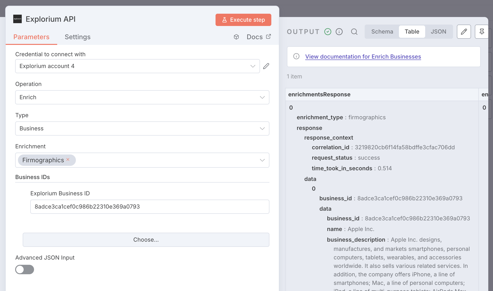

# n8n-nodes-explorium-ai

This project provides n8n community nodes for seamless integration with explorium.ai's powerful data enrichment and AI capabilities. With minimal setup required, you can leverage Explorium's features directly in your n8n workflows.

## Features

### 1. Explorium API Node
Access all Explorium Agent Source API functions. Seamless integration with n8n workflows

### 2. Explorium MCP Node
Direct integration with OpenAI through Explorium's Model Context Protocol (MCP)

## Prerequisites

- n8n instance (self-hosted or cloud)
- Explorium API Key
- OpenAI API Key (for MCP node only)

## Installation

1. Follow the [n8n community nodes installation guide](https://docs.n8n.io/integrations/community-nodes/installation/)
2. Install this package in your n8n instance
3. Configure the required environment variables

### Environment Variables

Both nodes require the following environment variables:
- `EXPLORIUM_API_KEY`: Your Explorium API key

The MCP node additionally requires:
- `OPENAI_API_KEY`: Your OpenAI API key

## Usage

### Getting Your API Keys

   - Visit [Explorium Developer Portal](https://developers.explorium.ai/reference/quick-starts)
   - Follow the steps to obtain your API key

   

### Node Configuration

Example of configuring the node for Firmographic enrichment:

### Workflow Example

Here's how to use the node in your workflow:

## Templates

Find ready-to-use templates on the Explorium n8n Creator page and in our integrations-templates repository.

Explorium n8n Creator page: https://n8n.io/creators/explorium/

Integrations Templates GitHub repo: https://github.com/explorium-ai/integrations-templates

## Resources

- [n8n Community Nodes Documentation](https://docs.n8n.io/integrations/community-nodes/)
- [Explorium Developer Documentation](https://developers.explorium.ai/)
- [Model Context Protocol Documentation](https://modelcontextprotocol.io/docs/)
- [AgentSource MCP Documentation](https://developers.explorium.ai/mcp-docs/agentsource-mcp)

## License

This project is licensed under the Apache License 2.0 - see the [LICENSE.md](LICENSE.md) file for details.

[n8n](https://n8n.io/) is a [fair-code licensed](https://docs.n8n.io/reference/license/) workflow automation platform.
